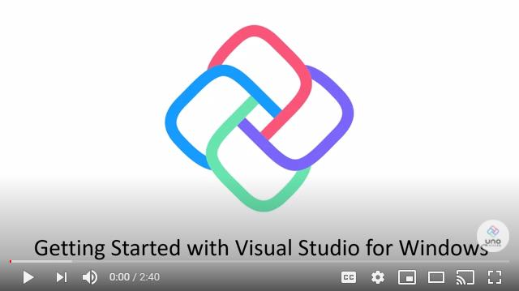
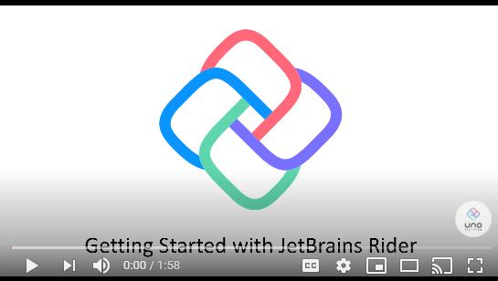

# Setting up your development environment

This guide will walk you through the set-up process for building cross-platform apps with Uno.

## Choose your IDE
Use Uno with your favorite tools.
* [Visual Studio](#visual-studio)
* [VS Code](#vs-code)
* [Visual Studio for Mac](#visual-studio-for-mac)
* [JetBrains Rider](#jetbrains-rider)

## Visual Studio 
### Prerequisites
* [**Visual Studio 2019 16.3 or later**](https://visualstudio.microsoft.com/), with:
    * **Universal Windows Platform** workload installed.

    

	* **Mobile development with .NET (Xamarin)** workload installed.

    

    *
        * the iOS Remote Simulator installed (for iOS development)
	    * A working Mac with Visual Studio for Mac, XCode 8.2 or later installed (for iOS development)
	    * Google's Android x86 emulators or a physical Android device (for Android development)

    * **ASP**.**NET and web** workload installed, along with .NET Core 2.2 or later (for WASM development)

    
    * [.NET Core](https://dotnet.microsoft.com/download/dotnet-core)

For more information about these prerequisites, see [Installing Xamarin](https://docs.microsoft.com/en-us/xamarin/get-started/installation/). For information about connecting Visual Studio to a Mac build host, see [Pair to Mac for Xamarin.iOS development](https://docs.microsoft.com/en-us/xamarin/ios/get-started/installation/windows/connecting-to-mac/).

### Installing the Uno Platform Solution Templates with Visual Studio

1. Launch Visual Studio, then click `Continue without code`. Click `Extensions` -> `Manage Extensions` from the Menu Bar.

    

2. In the Extension Manager expand the **Online** node and search for `Uno Platform Templates`, install the <code>Uno Platform Solution Templates</code> extension or download it from the [Visual Studio Marketplace](https://marketplace.visualstudio.com/items?itemName=nventivecorp.uno-platform-addin) extension, then restart Visual Studio.

    

### Create an application from the solution template

To easily create a multi-platform application:
* Create a new C# solution using the **Cross-Platform App (Uno Platform)** template, from Visual Studio's **Start Page**:


* Update to the latest NuGet package named `Uno.UI`. To get the very latest features, check the `pre-release` box.
* To debug the iOS head, select the `Debug|iPhoneSimulator` configuration
* To debug the Android head, select the `Debug|AnyCPU` configuration
* To debug the UWP head, select the `Debug|x86` configuration
* To run the WebAssembly (Wasm) head, select **IIS Express** and press **Ctrl+F5** or choose 'Start without debugging' from the menu. Note that **F5** will *not* work because Visual Studio debugging isn't supported. See [here](debugging-wasm.md) for debugging instructions through Chrome.

#### Make sure XAML Intellisense is enabled

[Intellisense](https://docs.microsoft.com/en-us/visualstudio/ide/using-intellisense) is supported in XAML when the UWP head is active:


If XAML Intellisense isn't working on a freshly-created project, try the following steps:
1. Build the UWP head.
2. Close all XAML documents.
3. Close and reopen Visual Studio.
4. Reopen XAML documents.

#### Video Tutorial
[](http://www.youtube.com/watch?v=hQcKsoxaAHo "")

## VS Code

This guide will walk you through the set-up process for building WebAssembly apps with Uno, under Windows, Linux or macOS.

### Prerequisites
* [**Visual Studio Code**](https://code.visualstudio.com/)

### Create an Uno Platform project

1. Launch Code, then in the terminal type the following to install the Uno Platform templates:
```bash
dotnet new -i Uno.ProjectTemplates.Dotnet
```
2. In the terminal type the following to create a new project:
```bash
dotnet new unoapp -o MyApp -ios=false -android=false -macos=false -uwp=false --vscodeWasm
```

This will create a solution that only contains the WebAssembly platform support.

### Prepare the WebAssembly application for debugging

1. Install the [C# extension](https://marketplace.visualstudio.com/items?itemName=ms-dotnettools.csharp) and the [JavaScript Debugger (Nightly)](https://marketplace.visualstudio.com/items?itemName=ms-vscode.js-debug-nightly) extension with the `debug.javascript.usePreview` setting set to true (**File** / **Preference** / **Settings**, search for `Use preview`).
2. Open Code using
    ```bash
    code ./MyApp`
    ```
3. Visual Studio Code will ask to restore the NuGet packages.

### Modify the template
1. In `MainPage.xaml`, replace the Grid's content with the following:
    ```xaml
    <StackPanel> 
        <TextBlock x:Name="txt" 
                    Text="Hello, world!" 
                    Margin="20" 
                    FontSize="30" /> 
        <Button Content="click" 
                Click="OnClick" /> 
    </StackPanel>
    ```
2. In your `MainPage.xaml.cs`, add the following method:
    ```csharp
    public void OnClick(object sender, object args) 
    { 
        var dt = DateTime.Now.ToString(); 
        txt.Text = dt; 
    }
    ```

### Run and Debug the application

1. Starting the app with the WebAssembly debugger is a two-step process:
    1. Start the app first using the **“.NET Core Launch (Uno Platform App)”** launch configuration
    2. Then start the browser using the **“.NET Core Debug Uno Platform WebAssembly in Chrome”** launch configuration (requires Chrome). To use the latest stable release of Edge instead of Chrome, change the type of the launch configuration in `.vscode/launch.json` from `pwa-chrome` to `pwa-msedge`
2. Place a breakpoint in the OnClick method
3. Click the button in the app, and the breakpoint will hit

### Updating an existing application to work with VS Code

If you already have an Uno application, you can add some some missing support files for VS Code to recognize your project.

Here's how to do this:
1. Use the same command line above to create a project with the same name as your current project, in a different location.
2. Once created, copy the generated `.vscode` folder next to your `.sln` file
3. Update the `Uno.UI` package version to the latest stable version
4. Update the `Uno.Wasm.Bootstrap` package to 1.2.0 or later version
5. Add a reference to `Uno.Wasm.Bootstrap.DevServer` version 1.2 or later.
6. In your Wasm project file, if you had a `<DotNetCliToolReference />` line, remove it

You should now be in the same configuration as the generated template files.

#### Video Tutorial
[](http://www.youtube.com/watch?v=O9qgw1Q445M "")

## Visual Studio For Mac

While it is easier to create apps using Uno on Windows, you can also create all but UWP apps on your Mac.

### Prerequisites
* [**Visual Studio for Mac**](https://visualstudio.microsoft.com/vs/mac/)
* [**Xcode**](https://apps.apple.com/us/app/xcode/id497799835?mt=12) 10.0 or higher
* An [**Apple ID**](https://support.apple.com/en-us/HT204316)
* .NET Core 3.1 or higher

### Modifying Existing Uno App

1. Open project in Visual Studio for Mac
 
Once open, you should see your folder structure set up like this:
\
If you have a warning symbol on your iOS project, make sure you have the minimum version of XCode.
\
To update, go to `Visual Studio > Preferences > Projects > SDK Locations > Apple` and select XCode 10.0 or higher.
Restart Visual Studio.

2. You can now run on iOS, Android, and WebAssembly by setting your startup project and running.

   
Note: You will not be able to build the UWP project on a Mac. All changes to this project must be made on Windows.

#### Build for WASM

Building for WebAssembly takes a few more steps than iOS and Android:

1. Set yourProject.Wasm to startup project
2. Build the project
3. In the terminal, navigate to your build output. This will typically be: `yourProject.Wasm > bin > Debug > netstandard2.0 > dist > server.py` Run the `server.py` program.
4. In your browser, open localhost:8000. 

#### Video Tutorial
[](http://www.youtube.com/watch?v=ESGJr6kHQg0 "")

## JetBrains Rider

### Prerequisites
* [**Rider Version "2020.2+"**](https://www.jetbrains.com/rider/)
* [**Rider Xamarin Android Support Plugin**](https://plugins.jetbrains.com/plugin/12056-rider-xamarin-android-support/)

### Creating a new Uno project
At this time, there isn't a template for the Rider IDE like there is for Visual Studio, so you can create a new project
by following these steps:

1. In your terminal, navigate to the folder that contains your Rider solutions.

2. Run these commands:

Installs Uno template:  
```bash
dotnet new -i Uno.ProjectTemplates.Dotnet
```
Creates a new project:  
```bash
dotnet new unoapp -o MyApp
```

You should now have a folder structure that looks like this:  


#### Android
1. Remove the following line from the `.csproj` file:  
`<Target Name="GenerateBuild" DependsOnTargets="SignAndroidPackage" AfterTargets="Build" Condition="'$(BuildingInsideVisualStudio)'==''" />`
2. Set Android as your startup project. Run.  

  
Note: Whether you're using a physical device or the emulator, the app will install but will not automatically open.
You will have to manually open.

#### Wasm
1. Select Wasm as your startup project. Run.  
  
A new browser window will automatically run your application.  

Note: There is no debugging for Wasm within Rider, but you debug using the built in Chrome tools. 

#### iOS and MacOS
You will be able to build the iOS project, however, there is currently no support for a simulator to begin debugging.  
  
Alternatively, you can use a tool like VNC to run the simulator on a mac.  

#### UWP
You will be able to build the UWP project, however, Rider currenly does not support debugging or deploying for UWP.   
  

#### Video Tutorial
[](http://www.youtube.com/watch?v=HgwL0al5bfo "")

<div class="NOTE alert alert-info">
<h5>Next:</h5>

[In the Creating an App tutorial you'll create your first working app with Uno.](getting-started-tutorial-1.md) 

</div>
