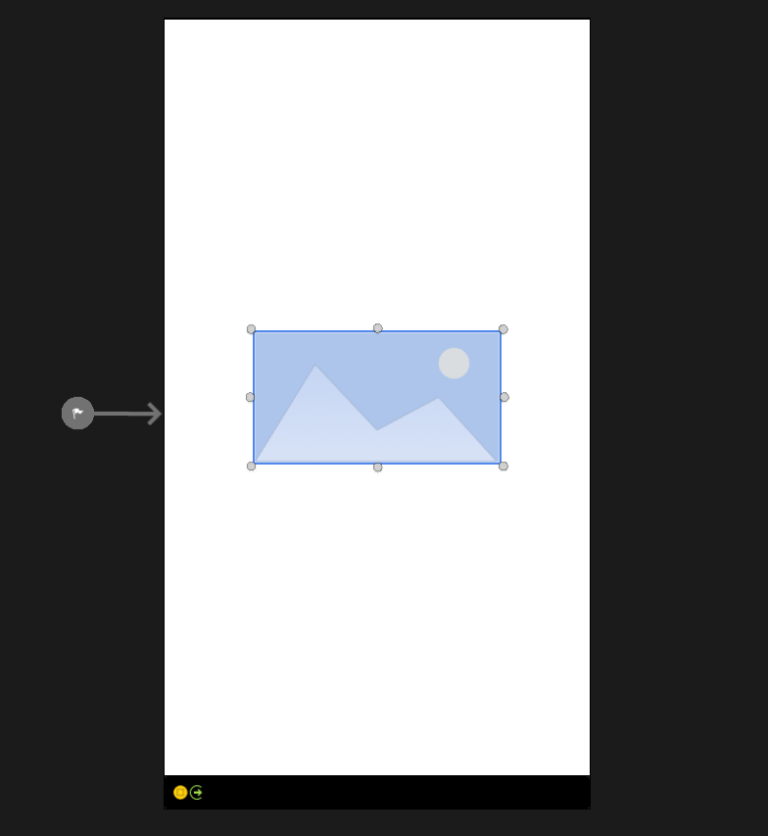
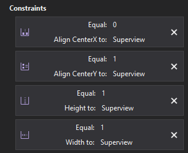
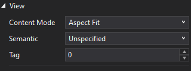
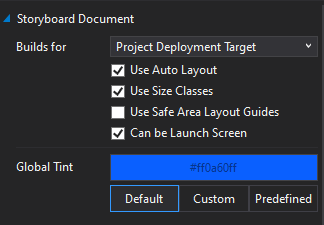

# Splash Screens

This article covers how to add a splash screen to your application.

As a first step, navigate to `YourProject.Shared > Assets` and add all [scales](#table-of-scales) of your splash screen image.

## UWP

In your UWP project head, navigate to `Package.appxmaifest > Visual Assets > Splash Screen` and add your images.

 

## Android 

1. In the Android project head, navigate to `Resources/values/Styles.xml`

2. Add an `android:windowBackground` `item` to the `AppTheme` style.  
```xaml
<item name=“android:windowBackground“>@drawable/splash</item>
```

3. Navigate to `Resources/drawable`

4. Create a `splash.xml` drawable  
``` xaml
<?xml version=“1.0“ encoding=“utf-8“?>
<layer-list xmlns:android=“http://schemas.android.com/apk/res/android“>
<item>
<!– background color –>
<color android:color=“#101010“/>
</item>
<item>
<!– splash image –>
<bitmap
android:src=“@drawable/splashscreen“
android:tileMode=“disabled“
android:gravity=“center“ />
</item>
</layer-list>
```

## iOS 

1. Right-click and select `Add > New item`

2. Create a new `StoryBoard` named `SplashScreen.storyboard` 

3. In the `Toolbox` window, drag and drop a `View Controller` and then an `ImageView` inside the `View Controller`. 



4. To have an image fill the screen, set your constraints as below



5. Set the `Content Mode` to `Aspect Fit` 



6. In the `Properties > Storyboard Document` window, select the `Can be Launch Screen` checkbox.



7. Close the designer and open the `.storyboard` file.

8. Add your image path to the `Image View`

``` xaml
<imageView … image=“Assets/SplashScreen“>
```

9. Navigate to `info.plist > Visual Assets > Launch Images` and update the `Launch Screen` value to `SplashScreen`.

## WebAssembly

1. In the Wasm project head, navigate to `WasmScripts/AppManifest.js` 

2. Add your splash screen image

``` javascript
var UnoAppManifest = {
splashScreenImage: “Assets/SplashScreen.scale-200.png”,
splashScreenColor: “#101010”,
displayName: “Uno.SplashScreenEverywhere”
}
```
Note: Currently, you need to set an explicit scale of the splash screen image.

## Table of scales

| Scale | UWP         | iOS      | Android |
|-------|:-----------:|:--------:|:-------:|
| `100` | scale-100   | @1x      | mdpi    |
| `125` | scale-125   | N/A      | N/A     |
| `150` | scale-150   | N/A      | hdpi    |
| `200` | scale-200   | @2x      | xhdpi   |
| `300` | scale-300   | @3x      | xxhdpi  |
| `400` | scale-400   | N/A      | xxxhdpi |
