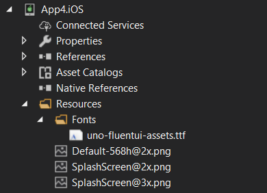
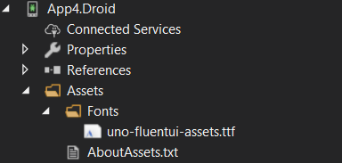
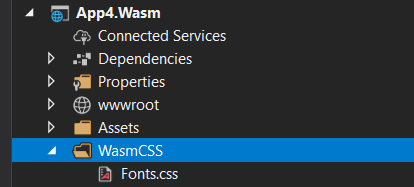

# Uno Fluent UI assets
> **IMPORTANT** \
This is a breaking change on most platform the font needs to be changed or most control will display incorrectly.

Uno has a new multiplatform font. The new font must be added manually to each platform to access the new symbols.

## Font files
The font is in this repository https://github.com/unoplatform/uno.fonts. The necessary files can be downloaded here: https://github.com/unoplatform/uno.fonts/tree/master/webfonts

>When downloading any of the Font files you can either clone or get the whole repository as a zip or if you want to download one file at the time you can do so by clicking on the specific file you want to download and then click on the Github built-in download button.
>
> Make sure not to right-click on the file and use 'Save Link As', as this may result in a corrupted file.

## Changes

### iOS & macOS
---
The `info.plist` file should be updated for both platforms, replacing the string `Fonts/winjs-symbols.ttf` with `Fonts/uno-fluentui-assets.ttf` in the file.

On iOS and macOS, Uno looks for a font named 'Symbols' (A font's name is not necessarily the name of the file). For this font to be available, the font file needs to be placed in the `Resources/Fonts` folder. The old `winjs-symbols.ttf` file can safely be deleted.  \
\
 \
\

\
Open the `.csproj` file (`YourApp.iOS.csproj` or `YourApp.macOS.csproj`). Replace the string `winjs-symbols.ttf` with `uno-fluentui-assets.ttf`.

### Android
---
Once Uno has been updated, it will start looking for a font file named uno-fluentui-assets.ttf in the assets folder: \
\

\
Open the `.csproj` (`YourApp.Droid.csproj`). Replace the string `Fonts/winjs-symbols.ttf` with `Fonts/uno-fluentui-assets.ttf`.
### WebAssembly
---
WASM won't break after the update, but to access the new symbols the file Font.css should be changed. The font is passed as a base64 string: \ \
\

\
Simply replace the contents of Font.css in your app with those of the `Font.css` linked to above.

## Known issues
On iOS and macOS the indeterminate state for a CheckBox is not the right color.

## Usage

The symbol font is automatically used by built-in styles and templates. You can reference it in XAML using the `SymbolThemeFontFamily` resource. For example:

```xaml
<FontIcon FontFamily="{ThemeResource SymbolThemeFontFamily}" Glyph="&#xE117;"/>
```

## Related Topics
- [3011](https://github.com/unoplatform/uno/issues/3011)
- [967](https://github.com/unoplatform/uno/issues/967)
